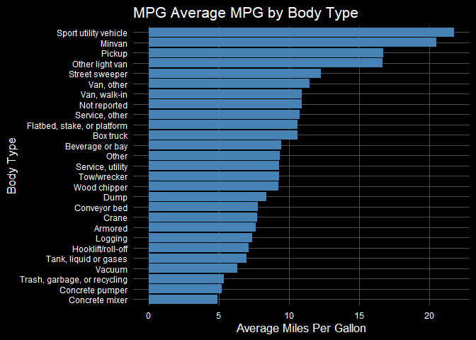

<!-- README.md is generated from README.Rmd. Please edit that file -->

# VIUSr

<!-- badges: start -->

[](https://github.com/jashonnew/VIUSr/actions/workflows/R-CMD-check.yaml)

<!-- badges: end -->

## Overview

**`VIUSr`** is an R package developed to facilitate the cleaning,
exploration, and visualization of data from the 2021 Vehicle Inventory
and Use Survey (VIUS) conducted across the United States. This package
provides a suite of tools to streamline the workflow from raw data to
actionable insights, supporting users in extracting meaningful patterns
at both national and state levels.

## Key Features

- **Automated Data Cleaning**: Efficiently prepares raw VIUS 2021 data
  into a tidy, analysis-ready format with minimal user intervention.
  Cleaning functions added include `convert_names`, `drop_bad_values`,
  and `charToNum`.
- **State-Level Exploration**: Generate focused summaries and
  visualizations for individual U.S. states to understand regional
  vehicle usage patterns.
- **Cross-State Comparison**: Compare metrics across states to identify
  trends and outliers in vehicle inventory and usage.
- **National Overview**: Access high-level summaries and visual
  representations of key statistics across the entire U.S.
- **Built-In Visualization Tools**: Create interactive and
  publication-ready plots, including maps and charts, with intuitive
  functions designed for ease of use.

`VIUSr` is ideal for transportation analysts, researchers, policy
makers, and data professionals seeking to work with VIUS 2021 data in a
reproducible and interpretable manner.

While many columns from the VIUS dataset are included in our cleaned
version of the 2021 data within the package, using a future year’s data
with the package or using any of the columns that we chose not to
include will require a local download of the dataset upon which you can
then apply our cleaning functions and subsequently use our graphing
functions.

## Installation

You can install the development version of VIUSr from
[jashonnew/VIUSr](https://github.com/jashonnew/VIUSr) with:

``` r
install.packages("jashonnew/VIUSr")
```

## Data Cleaning

This package contains a cleaned version of the 2021 VIUS data set. Three
functions, `drop_cols`, `char_to_num`, and `convert_names`, have been
included in the package to enable users to clean future editions of the
VIUS data set in the same way that the data has been cleaned herein.
Each function only takes one argument, the VIUS data set that the user
would like to clean. Future releases of the VIUS data set can be passed
through these functions to prepare them for use with the VIUSr package.

The data set `vius_raw_sample` has been included in the package to
demonstrate the data cleaning functions. This data set includes the
first 100 rows of the VIUS data set with no cleaning.

``` r
library(VIUSr)

head(vius_raw_sample)
#> # A tibble: 6 × 168
#>   ID    TABWEIGHT REGSTATE ACQUIREYEAR ACQUISITION AVGWEIGHT BRAKES BTYPE
#>   <chr>     <dbl> <chr>    <chr>             <dbl> <chr>     <chr>  <chr>
#> 1 00001      38.5 MT       11                    2 14        3      X    
#> 2 00002     197.  NC       Z                     2 12        3      X    
#> 3 00003    1709   SD       21P                   2 01        X      04   
#> 4 00004      52   ID       03                    2 X         3      X    
#> 5 00005     286.  MO       Z                     2 01        1      13   
#> 6 00006    8593.  MD       20                    1 01        X      04   
#> # ℹ 160 more variables: BUSRELATED <dbl>, CAB <chr>, CABDAY <chr>,
#> #   CABHEIGHT <dbl>, CI_AUTOEBRAKE <dbl>, CI_AUTOESTEER <dbl>,
#> #   CI_RAUTOEBRAKE <dbl>, CUBICINCHDISP <chr>, CW_BLINDSPOT <dbl>,
#> #   CW_FWDCOLL <dbl>, CW_LANEDEPART <dbl>, CW_PARKOBST <dbl>,
#> #   CW_RCROSSTRAF <dbl>, CYLINDERS <chr>, DC_ACTDRIVASST <dbl>,
#> #   DC_ADAPCRUISE <dbl>, DC_LANEASST <dbl>, DC_PLATOON <dbl>, DC_VTVCOMM <dbl>,
#> #   DEADHEADPCT <chr>, DRIVEAXLES <dbl>, ENGREBUILD <chr>, ER_COMPOWN <chr>, …

vius_cleaned <- drop_cols(vius_raw_sample)
vius_cleaned <- char_to_num(vius_cleaned)
vius_cleaned <- convert_names(vius_cleaned)
head(vius_cleaned)
#> # A tibble: 6 × 17
#>   ID    TABWEIGHT REGSTATE ACQUIREYEAR AVGWEIGHT BTYPE  ER_COST FUELTYPE GM_COST
#>   <chr>     <dbl> <chr>          <dbl>     <dbl> <chr>    <dbl> <chr>      <dbl>
#> 1 00001      38.5 MT                11    115000 <NA>         0 Diesel      3000
#> 2 00002     197.  NC                NA     70000 <NA>         0 Diesel      7500
#> 3 00003    1709   SD                21      3000 Sport…       0 Gasoline     250
#> 4 00004      52   ID                 3    130000 <NA>         0 <NA>       10000
#> 5 00005     286.  MO                NA      3000 Flatb…       0 Gasoline   10000
#> 6 00006    8593.  MD                20      3000 Sport…       0 Gasoline     250
#> # ℹ 8 more variables: KINDOFBUS <chr>, MILESANNL <dbl>, MILESLIFE <dbl>,
#> #   MODELYEAR <dbl>, MPG <dbl>, PRIMCOMMACT <chr>, PRIMPROD <fct>,
#> #   TRIPOFFROAD <dbl>
```

## VIUS Plotting

### Vehicle Body Type Averages

The `get_btype_graphs()` function computes weighted averages by vehicle
body type and generates a horizontal bar chart.

``` r
get_btype_graphs(vius1 = vius,
                 var = `MPG`,
                 plot_title = "Average MPG by Body Type",
                 x_plot_label = "Body Type",
                 y_plot_label = "Average Miles Per Gallon")
```



### Mapping State-Level Data

The `get_state_maps()` function visualizes state-level VIUS data on an
interactive U.S. map. This interactive plotting feature does not render
inside the `github_document` format but please try it for yourself with
the code below!

``` r
get_state_maps(vius = vius,
               var = `MPG`,
               var_label = "Fuel Volume",
               dollars = FALSE)
```

### Batch Plotting by State

To generate multiple bar plots by state, use the `get_state_graphs()`
function. This is useful when you want to examine how a specific
variable varies across different U.S. states.

Note: This function produces multiple plots and is best used in an
interactive session or saved to files.

``` r
Reference only
get_state_graphs(dataset = vius,
                  db_header = `MPG`,
                  states = c("CA", "TX", "NY"),
                  plot_title = "Average MPG by State",
                  x_plot_label = "Average MPG",
                  y_plot_label = "State")
```
