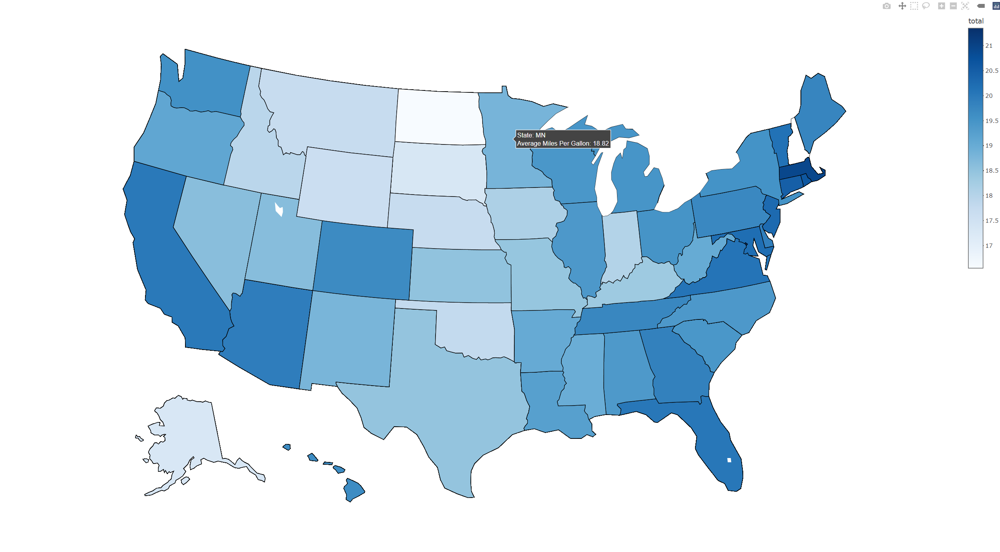
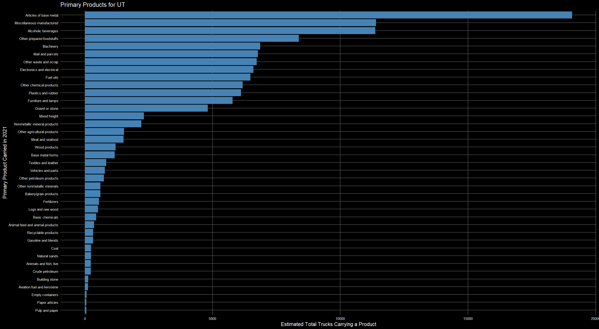

```{r, include = FALSE}
knitr::opts_chunk$set(
  collapse = TRUE,
  comment = "#>",
  fig.path = "man/figures/README-",
  out.width = "100%"
)
```

```{r setup}
library(VIUSr)
```

## Overview

**`VIUSr`** is an R package developed to facilitate the cleaning, exploration, and visualization of data from the 2021 Vehicle Inventory and Use Survey (VIUS) conducted across the United States. This package provides a suite of tools to streamline the workflow from raw data to actionable insights, supporting users in extracting meaningful patterns at both national and state levels.

## Key Features

-   **Automated Data Cleaning**: Efficiently prepares raw VIUS 2021 data into a tidy, analysis-ready format with minimal user intervention. Cleaning functions added include `convert_names`, `drop_bad_values`, and `charToNum`.
-   **State-Level Exploration**: Generate focused summaries and visualizations for individual U.S. states to understand regional vehicle usage patterns.
-   **Cross-State Comparison**: Compare metrics across states to identify trends and outliers in vehicle inventory and usage.
-   **National Overview**: Access high-level summaries and visual representations of key statistics across the entire U.S.
-   **Built-In Visualization Tools**: Create interactive and publication-ready plots, including maps and charts, with intuitive functions designed for ease of use.

`VIUSr` is ideal for transportation analysts, researchers, policy makers, and data professionals seeking to work with VIUS 2021 data in a reproducible and interpretable manner.

While many columns from the VIUS dataset are included in our cleaned version of the 2021 data within the package, using a future year's data with the package or using any of the columns that we chose not to include will require a local download of the dataset upon which you can then apply our cleaning functions and subsequently use our graphing functions.

## Installation

You can install the development version of VIUSr from [jashonnew/VIUSr](https://github.com/jashonnew/VIUSr) with:

``` r
install.packages("jashonnew/VIUSr")
```

## Dataset Description

The VIUS dataset contains several categorical and quantitative variables. The dataset in this package keeps a subset of both of these types of variables.

### Categorical
**Note:** Many of these variables are represented in the VIUS dataset as numbers that represent different values of the variable. The vius dataset included in this package has converted these values to the string values that the numbers represent.

* ID: The unique ID number of each sampled vehicle
* REGSTATE: The US state in which the vehicle is registered
* BTYPE: The body type of the vehicle
* FUELTYPE: The type of fuel the vehicle consumes
* KINDOFBUS: The kind of business activity the vehicle is most often used for
* PRIMCOMMACT: The commercial activity that the vehicle is most often used for
* PRIMPROD: The primary product carried by the vehicle

### Quantitative
**Note:** Many of these variables are represented in the VIUS dataset as placeholder numbers that represent different values of the variable. The vius dataset included in this package has converted these values to the numeric values that the placeholder numbers represent.

* TABWEIGHT: The weight factor for each sampled vehicle
* ACQUIREYEAR: The year in which the current owner acquired the vehicle - all vehicles acquired in 1999 or earlier are grouped together
* AVGWEIGHT: The average weight (in pounds) of the vehicle in its most common trailer configuration
* ER_COST: The total cost (in US dollars) of extensive vehicle repairs in 2021
* GM_COST: The total cost (in US dollars) of general vehicle maintenance in 2021
* MILESANNL: The number of miles driven in 2021
* MILESLIFE: The number of miles driven since the vehicle was manufactured
* MODELYEAR: The model year of the vehicle - all vehicles manufactured in 1999 or earlier are grouped together
* MPG: The average miles per gallon
* TRIPOFFROAD: Percent of miles driven off road

## Data Cleaning

This package contains a cleaned version of the 2021 VIUS data set. Three functions, `drop_cols`, `char_to_num`, and `convert_names`, have been included in the package to enable users to clean future editions of the VIUS data set in the same way that the data has been cleaned herein. Each function only takes one argument, the VIUS data set that the user would like to clean. Future releases of the VIUS data set can be passed through these functions to prepare them for use with the VIUSr package.

The data set `vius_raw_sample` has been included in the package to demonstrate the data cleaning functions. This data set includes the first 100 rows of the VIUS data set with no cleaning.

```{r example}
library(VIUSr)

head(vius_raw_sample)

vius_cleaned <- drop_cols(vius_raw_sample)
vius_cleaned <- char_to_num(vius_cleaned)
vius_cleaned <- convert_names(vius_cleaned)
head(vius_cleaned)
```

Above you can see an example of how one would take a new VIUS survey data set and clean it up for use with the VIUSr package. The process can be done in any order, but the above order is recommended. 

* drop_cols(): picks out the most informative columns from the expansive VIUS data set
* char_to_num(): transforms many quantitative variables into numeric formats for easier and more informative data analysis 
* convert_names(): transforms VIUS specific code names for many of the categorical variables into user readable names for what those categories are referring to. 

## VIUS Plotting

### Vehicle Body Type Averages

The `get_btype_graphs()` function computes weighted averages by vehicle body type and generates a horizontal bar chart.

```{r, fig.width=7, fig.height=5}
get_btype_graphs(vius1 = vius,
                 var = MPG,
                 plot_title = "Average MPG by Body Type",
                 x_plot_label = "Body Type",
                 y_plot_label = "Average Miles Per Gallon")
```

Here you can see a plot a user of this package can make with one function call that shows the average miles per gallon for all of the body types included in the package data set.

### Mapping State-Level Data

The `get_state_maps()` function visualizes state-level VIUS data on an interactive U.S. map. This is an interactive plotting feature, allowing user of this package to see the not just which states have the highest values for the variable they choose but also see the exact values for any given state. Below is how one would call the function.

``` r
get_state_maps(vius = vius,
               var = MPG,
               var_label = "Average Miles Per Gallon",
               dollars = FALSE)
```
<div style="text-align: center;">

```{r, echo=FALSE, out.width="100%"}

```

</div>

Here you can see how one would use the `get_state_maps()` function, whatever variable the user is interested in you can see the entire country and which states have the highest averages for that value, this in necessary or states like Texas and California would dominate all the graphs. Then the user can hover their mouse over any states they are interested in and see the exact value. 

### Batch Plotting by State

To generate multiple bar plots by state, use the `get_state_graphs()` function. This is useful when you want to examine how a specific categorical variable varies across different U.S. states.

Note: This function produces multiple plots and is best used in an interactive session or saved to files.

``` r
get_state_graphs(dataset = vius,
                  db_header = PRIMPROD,
                  states = c("CA", "TX", "UT"),
                  plot_title = "Primary Products for",
                  x_plot_label = "Primary Product Carried in 2021",
                  y_plot_label = "Estimated Total Trucks Carrying a Product")
```
<div style="text-align: center;">

```{r, echo=FALSE, out.width="100%"}

```

</div>

Here is the final graph the code above would produce. This shows the estimated total number of trucks that carry each of the products in Utah. 

### Package URL: <https://github.com/jashonnew/VIUSr>
